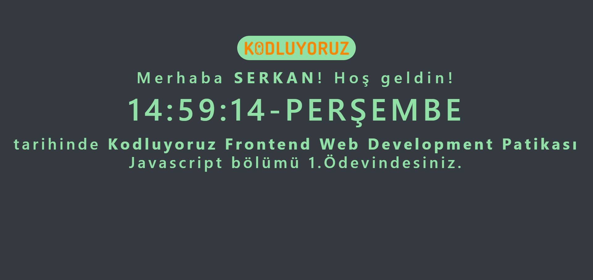

## Java Script 1.Ödev
---
### Bu ödev ile geliştirilen uygulamada;

* Bir HTML arayüz oluşturma
* CSS ile stillendirme
* JavaScript ile kullanıcıdan bir girdi alma (prompt)
* JavaScript ile anlık tarihi alma
* JavaScript ile alınan tarihi dinamik olarak değiştirerek bir zaman sayıcı oluşturma (setTimeOut)  
* JavaScript ile alınan tarihin gün değerien göre karar yapılarını kullanarak metinsel günü yazdırma

### işlemleri yapıldı.

